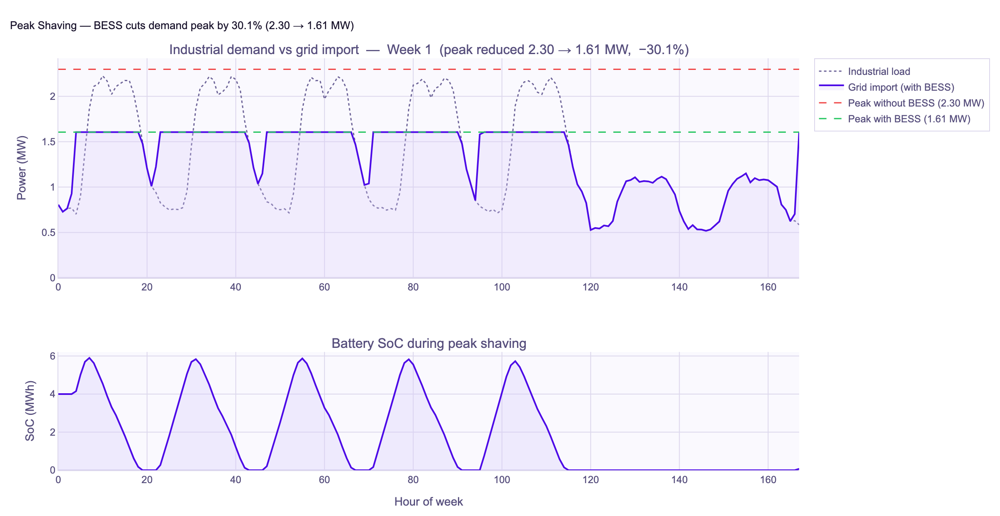
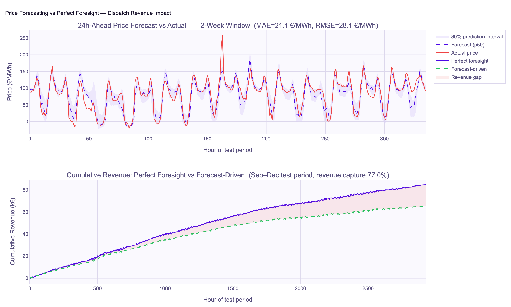
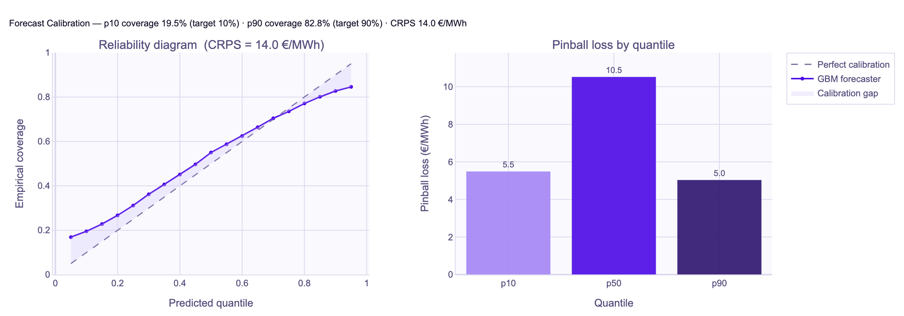

# BESS Arbitrage Optimizer

[](https://github.com/parthivmehta1812/bess-arbitrage-optimizer/actions/workflows/ci.yml)
[](https://www.python.org/)
[](LICENSE)

A Python toolkit for BESS dispatch optimisation covering three use cases:

- **Arbitrage** — revenue-maximising charge/discharge schedule against hourly day-ahead prices (MILP, Pyomo + HiGHS)
- **Peak shaving** — minimise maximum grid import to cut industrial demand charges (MILP)
- **24h-ahead price forecasting** — gradient-boosted regression trees with calibrated 80% prediction intervals, evaluated against actual revenue capture

---

## Results

### Arbitrage — 2 MW / 8 MWh battery, 2023 German ENTSO-E prices

| Parameter | Unconstrained | RFNBO Compliant |
|---|---|---|
| Annual Revenue | €289,981 | €194,709 |
| Annual Cycles | 539 | 211 |
| Avg Charge Price | 49.68 €/MWh | −2.91 €/MWh |
| Avg Discharge Price | 128.74 €/MWh | 117.05 €/MWh |
| RFNBO Revenue Penalty | — | €95,271 (32.9%) |
| Solver | HiGHS (optimal) | HiGHS (optimal) |

### Peak Shaving — synthetic industrial factory load

| Metric | Value |
|---|---|
| Peak demand without BESS | 2.30 MW |
| Peak demand with BESS | 1.61 MW |
| Peak reduction | **30.1%** |
| Battery | 2 MW / 8 MWh |

### Price Forecasting — Sep–Dec hold-out

| Metric | Value |
|---|---|
| MAE | 21.1 €/MWh |
| RMSE | 28.1 €/MWh |
| CRPS | 14.1 €/MWh |
| p90 empirical coverage | 82.8% (target 90%) |
| Revenue capture vs perfect foresight | 77.0% |

> **Calibration note:** the p90 quantile covers 82.8% of hold-out hours against a 90% target, so the upper bound is about 7 points too tight. The intervals are reported as measured and have not been recalibrated; see the reliability diagram below.

---

## Plots

### Arbitrage dispatch — Week 1


### Monthly arbitrage revenue


### Peak shaving — industrial load vs grid import


### Forecast accuracy and revenue capture


### Forecast calibration — reliability diagram + CRPS


---

## Features

| Feature | Details |
|---|---|
| **Arbitrage MILP** | Maximise day-ahead revenue; charge low, discharge high |
| **Peak-shaving MILP** | Minimise max grid import; cuts industrial demand charges |
| **Co-sizing mode** | Jointly optimise capacity, power, and schedule under an E:P ratio window |
| **RFNBO compliance gate** | Block charging at prices > 20 EUR/MWh (additionality proxy) |
| **Round-trip efficiency** | Symmetric √η split across charge and discharge legs |
| **Price forecaster** | GBM with cyclic calendar encoding, lagged prices, 80% prediction intervals |
| **Forecast calibration** | Reliability diagram and CRPS to evaluate probabilistic forecast quality |
| **Forecast-driven dispatch** | Run MILP on forecast prices; evaluate revenue capture vs perfect foresight |

---

## Problem Formulation

### Arbitrage dispatch

**Decision variables (per hour *t*):**

| Variable | Domain | Meaning |
|---|---|---|
| `charge[t]` | ℝ≥0 | MW drawn from grid |
| `discharge[t]` | ℝ≥0 | MW exported to grid |
| `soc[t]` | ℝ≥0 | MWh stored (State of Charge) |
| `is_charging[t]` | {0, 1} | Mutex binary: 1 = charging |

$$\max \sum_{t=1}^{8760} \lambda_t \left( \text{discharge}_t \cdot \sqrt{\eta} - \frac{\text{charge}_t}{\sqrt{\eta}} \right)$$

### Peak shaving

**Additional variable:**

| Variable | Domain | Meaning |
|---|---|---|
| `peak` | ℝ≥0 | Maximum grid import across all hours |

$$\min \; \text{peak} \quad \text{subject to} \quad \text{peak} \geq D_t + \text{charge}_t - \text{discharge}_t \quad \forall t$$

where $D_t$ is the industrial electricity demand at hour *t*.

### Key constraints (both modes)

```
soc[t]  =  soc[t-1]  +  charge[t-1]·√η  −  discharge[t-1]/√η     (dynamics)
0       ≤  soc[t]    ≤  cap                                         (capacity)
soc[0]  =  soc₀ · cap                                              (initial SoC)
soc[T]  ≥  0.5 · cap                                               (terminal SoC)
charge[t]    ≤  M · is_charging[t]                                  (mutex — Big-M)
discharge[t] ≤  M · (1 − is_charging[t])
```

---

## Installation

```bash
git clone https://github.com/parthivmehta1812/bess-arbitrage-optimizer.git
cd bess-arbitrage-optimizer
pip install -e ".[dev]"
pip install highspy   # recommended solver
```

---

## Quick Start

### Arbitrage

```python
from bess_arbitrage import optimize_bess_arbitrage

result = optimize_bess_arbitrage(
    battery_capacity_mwh=8.0,
    max_power_mw=2.0,
    efficiency=0.92,
)
print(f"Annual revenue : €{result['kpis']['annual_revenue_eur']:,.0f}")
print(f"Annual cycles  : {result['kpis']['annual_cycles']}")
```

### Peak shaving

```python
from bess_arbitrage import optimize_peak_shaving, make_industrial_load

load = make_industrial_load(peak_mw=2.2, base_mw=0.4)
result = optimize_peak_shaving(load, battery_capacity_mwh=8.0, max_power_mw=2.0)

print(f"Peak without BESS : {result['peak_without_mw']:.2f} MW")
print(f"Peak with BESS    : {result['peak_with_mw']:.2f} MW")
print(f"Reduction         : {result['peak_reduction_pct']:.1f}%")
```

### Price forecasting with calibration

```python
from bess_arbitrage import train_price_forecaster, forecast_prices
import numpy as np

prices = ...  # np.ndarray, 8760 hourly prices

models = train_price_forecaster(prices, train_end_h=5832)
point, lower, upper = forecast_prices(models, prices, start_h=5832, end_h=8760)

# Empirical calibration check
actuals = prices[5832:8760]
print(f"p90 coverage: {np.mean(actuals <= upper) * 100:.1f}%  (target 90%)")
```

See [`examples/`](examples/) for complete scripts.

---

## API Reference

### `optimize_bess_arbitrage(...) → dict`

| Parameter | Type | Default | Description |
|---|---|---|---|
| `price_bytes` | `bytes \| None` | `None` | Raw CSV/XLSX bytes; `None` uses bundled 2023 DE data |
| `battery_capacity_mwh` | `float` | `8.0` | Fixed capacity in MWh |
| `max_power_mw` | `float` | `2.0` | Fixed power rating in MW |
| `efficiency` | `float` | `0.92` | Round-trip efficiency (0–1) |
| `optimize_sizing` | `bool` | `False` | Co-optimise capacity and power |
| `rfnbo_compliant` | `bool` | `False` | Block charging above 20 EUR/MWh |
| `initial_soc` | `float` | `0.5` | Initial SoC as fraction of capacity |

### `optimize_peak_shaving(load_profile, ...) → dict`

| Parameter | Type | Default | Description |
|---|---|---|---|
| `load_profile` | `np.ndarray` | — | Hourly demand [MW], shape (T,) |
| `battery_capacity_mwh` | `float` | `8.0` | Battery capacity in MWh |
| `max_power_mw` | `float` | `2.0` | Max charge/discharge rate in MW |
| `efficiency` | `float` | `0.92` | Round-trip efficiency (0–1) |

**Returns** `peak_without_mw`, `peak_with_mw`, `peak_reduction_pct`, and hourly `schedule`.

### `make_industrial_load(peak_mw, base_mw, seed) → np.ndarray`

Generates a synthetic 8,760-hour industrial load profile with day/night, weekday/weekend, and Gaussian noise.

### `train_price_forecaster(prices, train_end_h, n_estimators) → tuple`

Returns `(model_p50, model_p10, model_p90)` — three fitted scikit-learn GBM estimators.

### `forecast_prices(models, prices, start_h, end_h) → tuple`

Returns `(point, lower, upper)` — p50, p10, p90 forecasts as `np.ndarray`.

---

## Running Tests

```bash
pytest tests/ -v --cov=bess_arbitrage
```

---

## Price Data

Bundled 2023 German ENTSO-E dataset (8,760 hourly values, min −129.8, max +583.4 EUR/MWh). For other years or markets, download from [ENTSO-E Transparency Platform](https://transparency.entsoe.eu/) and pass via `price_bytes`.

---

## License

MIT — see [LICENSE](LICENSE).
