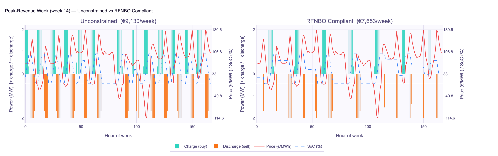
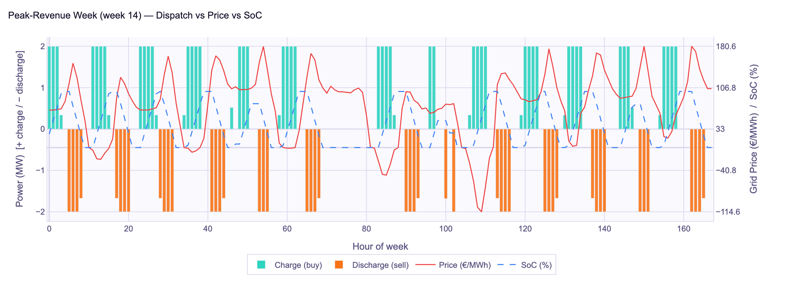
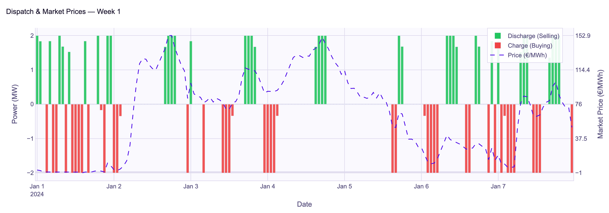
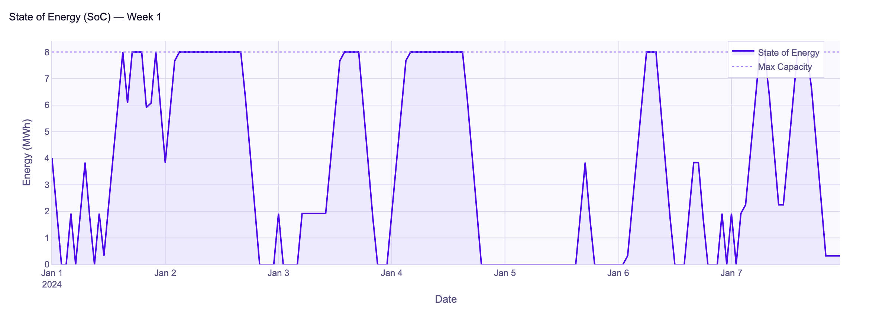
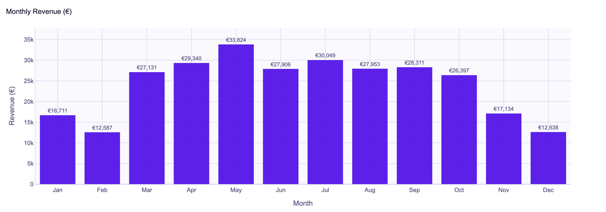
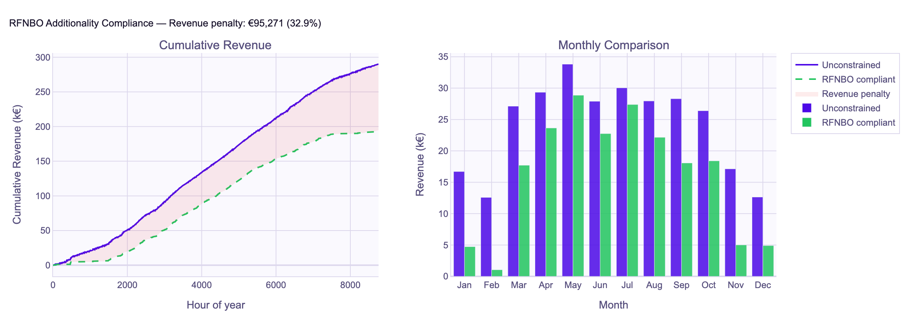

# BESS Arbitrage Optimizer

[](https://github.com/parthivmehta1812/bess-arbitrage-optimizer/actions/workflows/ci.yml)
[](https://www.python.org/)
[](LICENSE)

A **Mixed-Integer Linear Program (MILP)** that finds the revenue-maximising
charge / discharge schedule for a grid-connected Battery Energy Storage System
(BESS) given hourly day-ahead electricity prices.

Built with [Pyomo](http://www.pyomo.org/) and solved with the open-source
[HiGHS](https://highs.dev/) solver (falls back to CBC).

---

## Results

### Run Parameters & Key Results

| Parameter | Unconstrained | RFNBO Compliant |
|---|---|---|
| Battery Capacity | 8.0 MWh | 8.0 MWh |
| Power Rating | 2.0 MW | 2.0 MW |
| E:P Ratio | 4.0 h | 4.0 h |
| Round-trip Efficiency | 92.0% | 92.0% |
| Annual Revenue | €289,981 | €194,709 |
| Annual Cycles | 539 | 211 |
| Total Charged | 4,688 MWh | 1,829 MWh |
| Total Discharged | 4,314 MWh | 1,685 MWh |
| Avg Charge Price | 49.68 €/MWh | −2.91 €/MWh |
| Avg Discharge Price | 128.74 €/MWh | 117.05 €/MWh |
| RFNBO Revenue Penalty | — | €95,271 (32.9%) |
| Solver | HiGHS (optimal) | HiGHS (optimal) |

> Results based on real 2023 German ENTSO-E day-ahead prices (min −129.8, max +583.4 EUR/MWh).

---

### Plots













---

## Features

| Feature | Details |
|---|---|
| **Fixed-sizing mode** | Optimise schedule for a given capacity (MWh) and power (MW) |
| **Co-sizing mode** | Jointly optimise capacity, power, and schedule under an E:P ratio window |
| **RFNBO compliance gate** | Block charging at prices > 20 EUR/MWh (additionality proxy) |
| **Round-trip efficiency** | Symmetric √η split across charge and discharge legs |
| **Terminal SoC constraint** | Prevents end-of-year drain exploitation |
| **Custom price data** | Pass any hourly CSV / Excel price series; falls back to bundled 2024 DE data |

---

## Problem Formulation

### Decision variables (per hour *t*)

| Variable | Domain | Meaning |
|---|---|---|
| `charge[t]` | ℝ≥0 | MW drawn from grid |
| `discharge[t]` | ℝ≥0 | MW exported to grid |
| `soc[t]` | ℝ≥0 | MWh stored (State of Charge) |
| `is_charging[t]` | {0, 1} | Mutex: 1 = charging |

In co-sizing mode two additional continuous variables are added:

| Variable | Domain | Meaning |
|---|---|---|
| `cap` | ℝ≥0 | Battery capacity (MWh) |
| `power` | ℝ≥0 | Power rating (MW) |

### Objective

$$\max \sum_{t=1}^{8760} \lambda_t \left( \text{discharge}_t \cdot \sqrt{\eta} - \frac{\text{charge}_t}{\sqrt{\eta}} \right)$$

where $\lambda_t$ is the day-ahead price at hour *t* and $\eta$ is the
round-trip efficiency.

### Key constraints

```
soc[t]  =  soc[t-1]  +  charge[t-1]·√η  −  discharge[t-1]/√η     (dynamics)
0       ≤  soc[t]    ≤  cap                                         (capacity)
soc[0]  =  soc₀ · cap                                              (initial SoC)
soc[T]  ≥  0.5 · cap                                               (terminal SoC)
charge[t]    ≤  M · is_charging[t]                                  (mutex — Big-M)
discharge[t] ≤  M · (1 − is_charging[t])
ep_ratio_min · power  ≤  cap  ≤  ep_ratio_max · power              (E:P, sizing mode)
charge[t] = 0  if  λ_t > 20 EUR/MWh                                (RFNBO gate)
```

---

## Installation

```bash
git clone https://github.com/Parthiv18122000/bess-arbitrage-optimizer.git
cd bess-arbitrage-optimizer
pip install -e ".[dev]"
```

HiGHS (recommended solver):

```bash
pip install highspy
```

---

## Quick start

```python
from bess_arbitrage import optimize_bess_arbitrage

result = optimize_bess_arbitrage(
    battery_capacity_mwh=8.0,
    max_power_mw=2.0,
    efficiency=0.92,
)

kpis = result["kpis"]
print(f"Annual revenue : €{kpis['annual_revenue_eur']:,.0f}")
print(f"Annual cycles  : {kpis['annual_cycles']}")
```

### Co-sizing mode

```python
result = optimize_bess_arbitrage(
    optimize_sizing=True,
    max_grid_mw=10.0,
    ep_ratio_min=2.0,   # minimum 2-hour battery
    ep_ratio_max=4.0,   # maximum 4-hour battery
)
print(f"Optimal: {result['optimal_capacity_mwh']} MWh / {result['optimal_power_mw']} MW")
```

### Custom price data

```python
with open("my_prices.csv", "rb") as f:
    result = optimize_bess_arbitrage(price_bytes=f.read())
```

See [`examples/`](examples/) for more complete scripts.

---

## API reference

### `optimize_bess_arbitrage(...) → dict`

| Parameter | Type | Default | Description |
|---|---|---|---|
| `price_bytes` | `bytes \| None` | `None` | Raw CSV/XLSX bytes; `None` uses bundled sample |
| `battery_capacity_mwh` | `float` | `8.0` | Fixed capacity in MWh |
| `max_power_mw` | `float` | `2.0` | Fixed power rating in MW |
| `efficiency` | `float` | `0.92` | Round-trip efficiency (0–1) |
| `max_grid_mw` | `float` | `10.0` | Grid connection limit in MW |
| `optimize_sizing` | `bool` | `False` | Co-optimise capacity and power |
| `ep_ratio_min` | `float` | `2.0` | Min E:P ratio in hours (sizing mode) |
| `ep_ratio_max` | `float` | `4.0` | Max E:P ratio in hours (sizing mode) |
| `rfnbo_compliant` | `bool` | `False` | Block charging above 20 EUR/MWh |
| `initial_soc` | `float` | `0.5` | Initial SoC as fraction of capacity |

**Returns** a dict with keys `status`, `annual_revenue_eur`, `optimal_capacity_mwh`,
`optimal_power_mw`, `schedule` (hourly arrays), and `kpis` (summary dict).

---

## Running tests

```bash
pytest tests/ -v --cov=bess_arbitrage
```

---

## Price data

A bundled 2024 German ENTSO-E subset is included for testing.  For full
annual runs, download your own data from
[ENTSO-E Transparency Platform](https://transparency.entsoe.eu/) and pass
it via `price_bytes`.  See [`data/README.md`](data/README.md) for details.

---

## License

MIT — see [LICENSE](LICENSE).